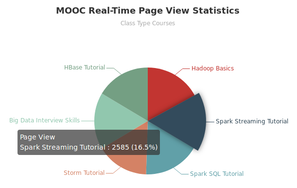

# MOOC Website Page View Statistics of Courses Web Application

**Version:**

- Linux: Ubuntu 16.04
- Java: 1.8.0_171
- Spring Boot: 2.0.4
- HBase: 1.2.6
- IDE: Intellij IDEA 2018.1.4 (Community Edition)

---

Create a Spring Boot web project to visualize data about page view statistics of class type courses on MOOC website.

This project is the user interface of [Spark Streaming Real Project](https://github.com/lizhanmit/sparktrain#spark-streaming-real-project).

---

**Detailed steps:**

1. Create a Spring Boot project. Add web dependency. In IDEA, File -> Settings -> Maven -> User settings file, tick "Override" checkbox, set directory as "/usr/local/maven/conf/settings.xml" (Maven installation directory).
2. Download echarts.common.min.js from ECharts website and copy to "src/main/resources/static/js" folder.
3. Add thymeleaf dependency in pom.xml for ECharts.

```
<dependency>
    <groupId>org.springframework.boot</groupId>
    <artifactId>spring-boot-starter-thymeleaf</artifactId>
</dependency>
```

4. Add HBase dependency in pom.xml for accessing data in HBase.

```
<dependency>
    <groupId>org.apache.hbase</groupId>
    <artifactId>hbase-client</artifactId>
    <version>1.2.6</version>
</dependency>
```

5. Create HBaseUtils.java under "src/main/java/com/zhandev/utils" folder.
6. Create ClassTypeCourseClickCount.java under "src/main/java/com/zhandev/domain" folder.
7. Create ClassTypeCourseClickCountDao.java under "src/main/java/com/zhandev/dao" folder.
8. Create StatStreamingProjectApp.java under "src/main/java/com/zhandev/project" folder.
9. Create courses-page-view.html under "src/main/resources/templates" folder to display charts at front end.
    - **Note:** make sure there is a "/" in `<meta charset="UTF-8"/>` in `<head></head>`. Otherwise, there will be errors.
10. Run MoocWebPageViewApplication.java. Visit <http://localhost:8080/moocwebpageview/courses-page-view>. You should see a pie chart of MOOC Real-Time Page View Statistics.
11. Deploy to production environment.
    1. In terminal, pack the Spring Boot project using maven. Under the Spring Boot project directory, `mvn clean package -DskipTests` (skip test). Then the .jar file will be created under "target" folder.
    2. Run the .jar file using `java -jar web-0.0.1.jar` under "target" folder. Then visit <http://localhost:8080/moocwebpageview/courses-page-view>. You should see the pie chart.

A potential error:

```
The Tomcat connector configured to listen on port 8080 failed to start. The port may already be in use or the connector may be misconfigured.
```

- Reason: You have already run the .jar file. Now you are trying to run the program in IDEA.
- Solution: Kill the process that is using port 8080.
    1. In terminal, `jps`, find the process number of "jar".
    2. `kill -9 <process_number_of_jar>`.

Screenshot:



Further improvement:

- Create a data connection pool for accessing data from HBase, which will improve the access speed.
- Add a calendar widget on the front end page allowing you to access data for any date instead of hard code. Default date is today.
- As it is for real-time statistics, the front end page should be refreshed automatically by adding a timer.
